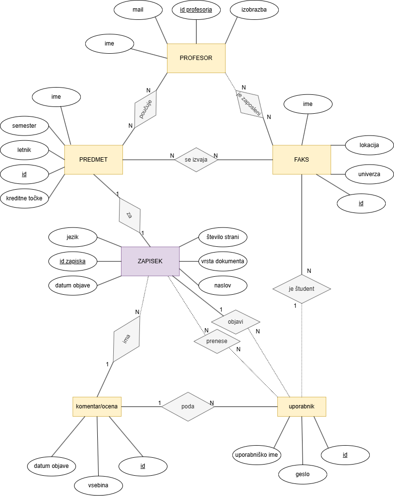

# OPB-izmenjevalnica_zapiskov
Aplikacija omogoča študentom izmenjavo zapiskov. Uporabnik lahko objavi svoje zapiske ali pa si prenese zapiske drugih uporabnikov, ter pod objavljen zapisek doda tudi komentar ali oceno. Prav tako lahko najde informacije o posameznih predmetih in profesorjih.

# ER diagram

