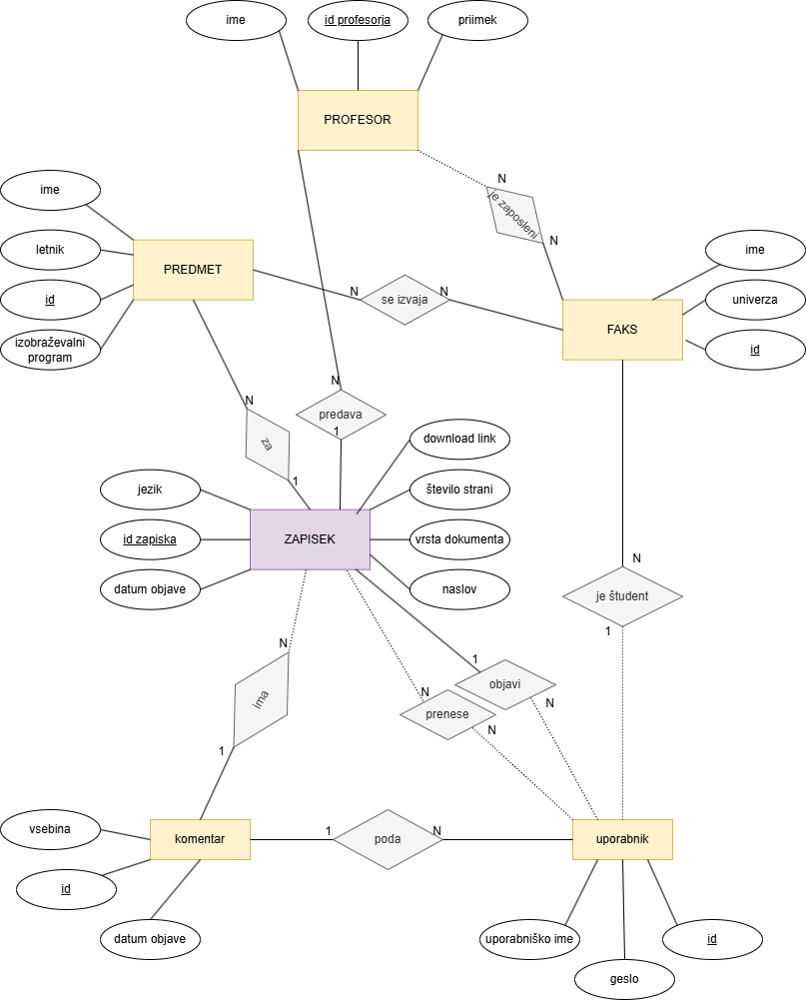

# OPB- Izmenjevalnica_zapiskov

**Izmenjevalnica zapiskov** je spletna platforma, namenjena deljenju in izmenjavi različnih študijskih zapiskov.  
Uporabniki lahko poiščejo, prenesejo, komentirajo ter nalagajo svoje zapiske.
Aplikacija uporablja podatkovno bazo, ki hrani podatke o zapiskih, avtorjih, komentarjih, fakultetah, predmetih in profesorjih  

---

## Funkcionalnosti
- **Prijava in registracija** uporabnikov
- **Iskanje zapiskov** po predmetu, profesorju, fakulteti ali študijskem programu  
- **Prenos zapiskov** na svoj računalnik  
- **Nalaganje lastnih zapiskov** za skupno rabo  
- **Dodajanje komentarjev** k posameznim zapiskom  
- **Upravljanje lastnih zapiskov** (brisanje, pregled prenesenih)  
- **Podrobni posameznega zapiska**

---

## Uporaba aplikacije
Ob obisku spletne strani Izmenjevalnica zapiskov se najprej prikaže prijavna stran, kjer lahko vnesete svoje uporabniško ime in geslo.
Če še nimate računa, se lahko na isti strani tudi registrirate.

Po uspešni prijavi so vam na voljo naslednje možnosti:
 - brskanje med lastnimi zapiski,
 - pregled zapiskov, ki ste jih prenesli,
 - dodajanje novih zapiskov,
 - iskanje zapiskov za prenos,
 - odjava
Za dodatne informacije o posameznem zapisku kliknete na njegov naslov.
Odpre se podrobna stran zapiska, kjer lahko preberete komentarje ali dodate svojega.

##  Testni račun
Za hiter dostop lahko uporabite testni račun z enakim uporabniškim imenom in geslom: j_novak

# ER diagram

